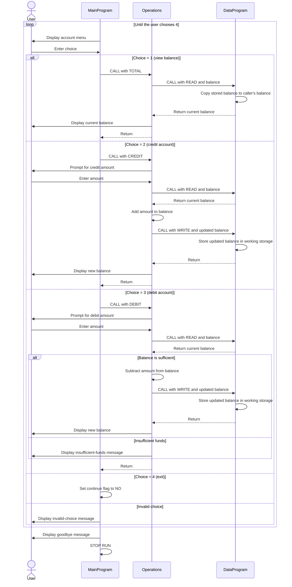

# Student Account Management System

This directory contains documentation for the COBOL student account example in `src/cobol/`. The program provides a simple command-line menu to view an account balance, credit the account, or debit it.

## COBOL programs

### `main.cob` - `MainProgram`

Runs the interactive menu and routes the user's choice to `Operations`:

- `1` requests the current balance (`TOTAL`, passed in a six-character field).
- `2` starts a credit (`CREDIT`).
- `3` starts a debit (`DEBIT`, passed in a six-character field).
- `4` exits the program.
- Any other choice displays an invalid-choice message.

### `operations.cob` - `Operations`

Performs the selected account operation. It reads the balance from `DataProgram` before displaying or changing it. Credits add the entered amount and write the result back. Debits subtract the entered amount only when the balance is sufficient; otherwise, the program displays an insufficient-funds message and leaves the balance unchanged.

### `data.cob` - `DataProgram`

Owns the account balance and handles `READ` and `WRITE` requests from `Operations`. The balance starts at `1000.00` and is held in working storage, so changes persist while the program is running but are not saved between separate runs.

## Student account rules

- The starting account balance is `1000.00`.
- A credit increases the balance by the amount entered.
- A debit is allowed only if the current balance is greater than or equal to the requested amount. An insufficient-funds debit does not change the balance.
- The balance and operation amount use `PIC 9(6)V99`, allowing up to six whole-number digits and two decimal places. The `V` is an implied decimal point in COBOL storage.
- The program does not define additional validation for entered amounts, such as rejecting zero or negative values. Do not assume such validation is performed.
- Account data is in-memory only; there is no file or database persistence.

## Application data flow

